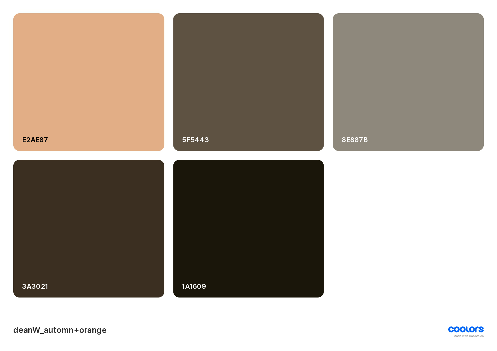
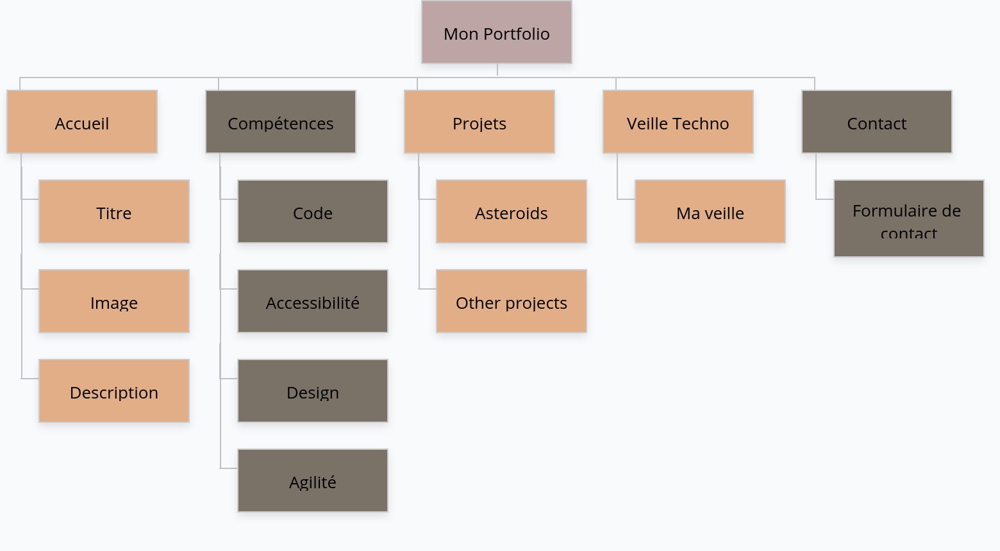
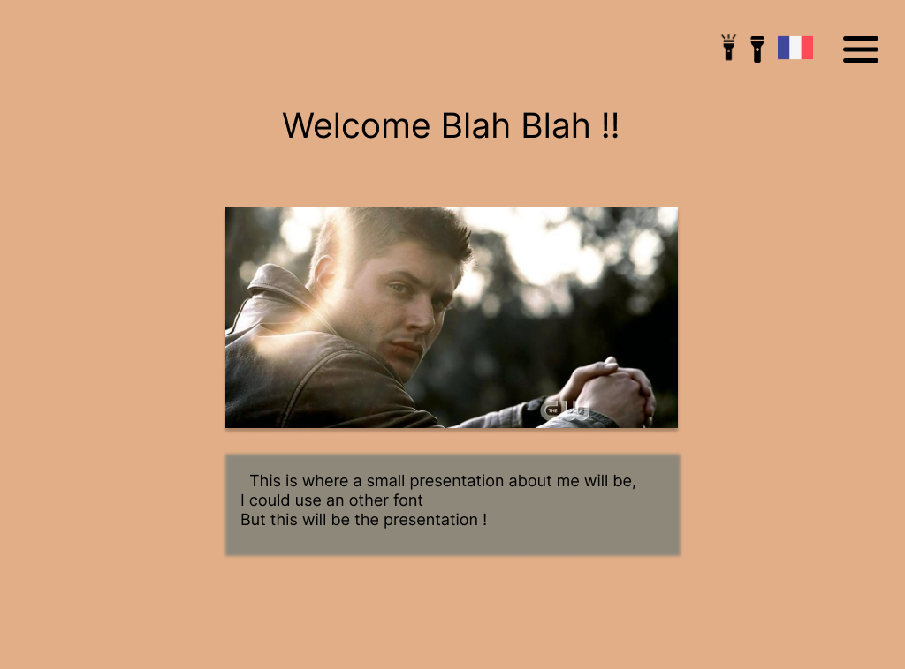
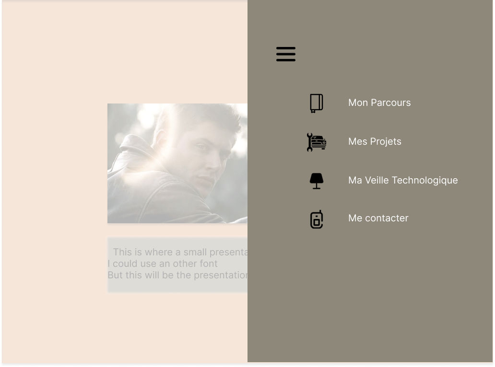

<b>Welcome to my Potfolio ! </b>

[lien de deploiement](https://ounissasadaoui.github.io/Portfolio/)


# Etapes de réalisation:

## Avant tout:

### La palette de couleurs:

J'ai pour ça choisi une palette de couleurs d'automne, en utilisant le site [Coolors](https://coolors.co/221d23-4f3824-d1603d-ddb967-d0e37f), d'après l'image de Dean Winchester dans Blood Lust, saison 2.

on peut voir la palette ici:


### Favicon:
Sur le site [favicon.io](https://favicon.io/), j'ai créé cette icone avec mes initiales pour l'utiliser comme favicon,la voici:
 
 

 ## Mes icônes:

 Je suis restée sur le thème de l'image, à savoir des icônes plutôt retro, prises sur le site [FontAwsome](https://fontawesome.com/).
 En voici la liste:

 ```html
  <i class="fa-solid fa-house"></i> //home
  <i class="fa-solid fa-book"></i>  //compétences
  <i class="fa-solid fa-mobile-retro"></i> //contact
  <i class="fa-solid fa-gears"></i> //projets
  <i class="fa-solid fa-person-biking"></i> //agilité
  <i class="fa-solid fa-eye"></i> //accessibilié
  <i class="fa-brands fa-html5"></i> //html
  <i class="fa-brands fa-css3-alt"></i> //CSS
  <i class="fa-brands fa-js"></i> //js
  <i class="fa-brands fa-java"></i> //java
  <i class="fa-solid fa-signs-post"></i> //i really don't remember, should've done it eralier
  <i class="fa-solid fa-code" style="color: #000000;"></i> //programmation
  <i class="fa-brands fa-sketch" style="color: #000000;"></i>//design graphique

```
* <b>Utiliser une icone dans html:</b> <i>How to</i>:

j'étais partie sur une bibliothèque d'icones de flaticons, mais je vais plus partir sur fontAwesome, qui est plus simple et facile à utiliser   
donc les étapes, c'est on copie dans le head cette ligne de code:
```
    <link rel="stylesheet" href="https://cdnjs.cloudflare.com/ajax/libs/font-awesome/6.4.2/css/all.min.css">

```

puis pour chaque icone utilisée, dans une balise i, ou span , on met son code 
```
 <i class="fa-solid fa-house"alt="icone maison"></i> 
 ```
 ## Mon schéma relationnel:

 Réalisé sur [GlooMaps](https://www.gloomaps.com/)

 
 ## Ma maquette:
Sur figma, j'ai fait la maquette, de ce que je veux avoir comme résultat, pour l'instant, j'ai la page d'accueil, le menu, la page de contact, ainsi que la page du projet.

 <b>Ma page d'accueil:</b>
 

 <b> style général de mon menu:</b>


ce qu'il me faut encore:
  la page des compétences
  celle éducation
  une image pour ma page d'accueil.

pour la page de contact, je vais faire un simple formulaire de contact

## Création:
### Ma navbar:
Au début, je voulais partir sur un menu burger, sur le côté, révélant mes sections, mais j'ai finalement, jusqu'ici du moins, choisi de garder une nav bar tout en haut de la page
 * le but est quand meme que ça reste visible tout au long de la navigation

c'est une navbar classique, avec des icones à droite et à gauche, dans le header, les icones sont bien évidement cliquables, d'où les class et les href:
``` html
    <div class="navbar_droite">
     <a href="#"><i class="fa-solid fa-book" style="color: #000000;"></i></a>

```
### Ma section Compétences:
On utilise l'id "competences" utilisé plus haut, pour que le tout soit cohérent et surtout pour que quand on appuis sur le bouton, ça nous emmène à la section voulue.

<b>On fera la même chose pour toutes les sections </b>
<i>  Essai de faire une font pour les titres </i>

## Section Projets:

Ajout d'une bibliothèque d'images qui vont renvoyer sur les projets
 ça e
au clique sur chacune des images, on est renvoyé sur la page github correspondant au projet.
pour le style de la section, j'ai choisis un grid d'images, et celle en hover s'agrandit.


Idées amélioration:
* Pour le DarkMode, changer la partie grise, celle des compétences, mets du blanc peut être, et les icones en noir
* toujours pour le darkMode, je pense qu'il est mieux d'attendre d'avoir tout fini pour mettre en place les couleurs, comme ça je n'ai pas à le refaire tout le temps
* pour les compétences toujours, dans ma classe CSS, j'ai préféré mettre un border radius left et right en px, ça arrondit plus qu'en % => essayer de le mettre en rem si ça marche, comme ça j'ai tout en rem => ça marche bien en rem, on laisse comme ça.
* dans la prochaine parie que je fais, c'est à dire projets, réduire la taille, essayer d'arranger le fond.
* la partie d'après remettre du gris en fond, comme ça on est dans une certaine logique.
* penser à faire des petites transitions entre mes parties 